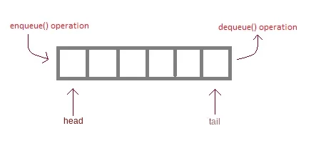

# DataStructure Journey

## What is Queue?
Queue is an elementary data structure that is based on ***FIFO*** policy that is short of First-in, first-out. It means that every element that is being removed from it, is the one that has been in the queue for the longest time. The idea is simple and comprehensible and but we may have some trouble implementing it.

  

See queue as real world queues. When somebody enters to the queue, they're not going to leave the queue until the people came sooner are left the queue. That's why we call Queue's policy *FIFO*.  The first one who came in the queue is the first one who leaves it.

Every queue has a *head* and a *tail*. *Head* is the pointer to the element that arrived most recently and the tail is the opposite. Also we use a counter called *length* to be informed of the number of elements in the *Queue*. These three components help us to implement queue more convenient.

## Operations

 - `Enqueue(S, x)`: This modifying operation, inserts element *x* behind the head of the queue and also modifies the head pointer to point to this element.
 - `Dequeue(S)`:  This is a modifying operation and also a query one. It removes the element that tail points to and also make tail to point to previous element and returns removed element.

