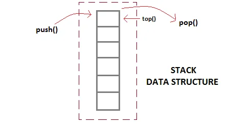

# DataStructure Journey

## What is Stack?
Stack is an elementary data structure that is based on ***LIFO*** policy that is short of Last-in, first-out. It means that every element that is being removed from it, is the one most recently inserted. The idea is simple and comprehensible and also you can implement it very easily.

  

As you see in the picture above, it's like  stack's elements are placing above each other when they're storing in the stack using operation `push(S, x)`. When we try to remove an element with operation `pop(S)` from stack, the top element, the element that is above all other elements is going to be removed and returned. This totally explains why we call its policy  *LIFO*.

## Operations

 - `top(S)`: A query that returns the top element. The top element is the element that is most recently inserted to stack.
 - `push(S, x)`: This modifying operation, inserts element *x* to the top of the stack.
 - `pop(S)`:  This is a modifying operation and also a query one. It removes the top element and returns it.
 - `stack_empty`(S): This query checks that stack *S* is empty or not. If it's empty returns `true` and otherwise returns `false`.

